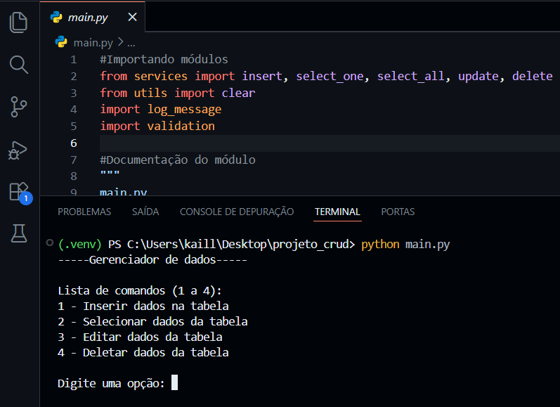

# Projeto CRUD (🐍python + 📊MySQL)

## 📖 Descrição do projeto
Projeto em **Python** para o gerenciamento de produtos utilizando **MySQL** como banco de dados.  
Foi implementando modularização, documentação, conexão com banco de dados, operações **CRUD** (Create, Read, Update, Delete), validação de dados, tratamento de excessões e exibição de mensagens de log.

## 💻Vídeo de demonstração do projeto
Clique na imagem abaixo e assista a um pequeno vídeo de demonstração do projeto:

<a href="https://vimeo.com/1171296837">
  
</a>

## 📂 Estrutura do Projeto
- **main.py** → Ponto de entrada da aplicação com menu interativo para o usuário.

- **services.py** → Conexão com o banco e operações CRUD.

- **validation.py** → Validação de entradas do usuário.

- **log_message.py** → Mensagens de log para interação com o usuário.

- **log_message_db.py** → Mensagens de log específicas para operações no banco.

- **utils.py** → Funções auxiliares (timestamp, cores ANSI, limpar terminal).

## 🚀 Pré-requisitos
- **IDE** (de sua preferência)
- **Python 3.10+**
- **MySQL** (local ou em nuvem)
- Bibliotecas listadas em `requirements.txt`

## 🛠️ Passo a passo para testar o projeto

### 1. Clonar o Repositório
Escolha uma pasta sua e no **terminal**, execute:

```bash
git clone https://github.com/Kalleby-dev12/Projeto_crud_MySQL.git
```

### 2. Configurar o Banco de Dados
Crie um banco de dados **MySQL** (local ou em nuvem).  
Dentro dele, crie uma database e dentro dela crie a tabela `produtos` com a seguinte estrutura:

```Sql
CREATE TABLE produtos (
    id INT AUTO_INCREMENT PRIMARY KEY,
    cod_barras VARCHAR(13) NOT NULL UNIQUE,
    nome VARCHAR(50) NOT NULL,
    preco DECIMAL(8,2) NOT NULL,
    estoque INT NOT NULL
);
```

### 3. Preparar o Ambiente Virtual
No diretório do projeto, crie uma **virtual environment (venv)**:

```bash
python -m venv .venv
```
Ative a **venv**:

- Windows

```bash
.venv\Scripts\activate
```
- Linux/Mac:
```bash
source .venv/bin/activate
```

### 4. Instalar Dependências
Com a **venv** ativa, instale as bibliotecas listadas no `requirements.txt`:

```bash
pip install -r requirements.txt
```

### 5. Configurar Variáveis de Ambiente

Na pasta do projeto, **crie** um arquivo `.env` com suas credenciais do banco de dados.
Dentro do arquivo do projeto já vem um arquivo `.env-example` para você usar como modelo

Arquivo de exemplo dentro do projeto:

```env
MYSQL_DB_HOST=CHANGE-ME
MYSQL_DB_USER=CHANGE-ME
MYSQL_DB_PASSWORD=CHANGE-ME
MYSQL_DB_NAME=CHANGE-ME
```

➡️ Basta copiar esse arquivo, renomear a cópia para somente `.env` e substituir o "**CHANGE-ME**" pelos dados reais do seu banco de dados.

Exemplo de como deve ficar no `.env`:

```env
MYSQL_DB_HOST="localhost"
MYSQL_DB_USER="teste123"
MYSQL_DB_PASSWORD="abc78653"
MYSQL_DB_NAME="mydbteste"
```

### 6. Executar o Projeto
Com a **venv** ativada, **bibliotecas instaladas** e os dados reais do banco de dados **já colocados no programa**, agora é só rodar o programa principal dentro do projeto:

```bash
python main.py
```
Você verá o menu interativo:

```python
----- Gerenciador de dados -----

Lista de comandos (1 a 4):
1 - Inserir dados na tabela
2 - Selecionar dados da tabela
3 - Editar dados da tabela
4 - Deletar dados da tabela
```

**pronto**, agora é só aproveitar o programa 😉

## 📌 Observações
- Antes de testar, **sempre** verifique se sua `venv` está ativada, para que assim o python  realmente consiga reconhecer as bibliotecas instaladas no projeto.

- Caso você já trabalhe com python ultilizando `venv`, quando você abrir o projeto e for criar e ativar a `venv` nele, verifique se você está realmente ativando a que está **dentro do projeto** e não alguma **externa** de outros projetos seus.

- O terminal `Git bash` pode não reconhecer o comando `.venv\Scripts\activate` ou `source .venv/bin/activate`, se isso ocorrer, tente usar o terminal do seu próprio sistema operacional.

## 👨‍💻 Desenvolvido por Marcos Kalleby
Aceito **feedbacks** para possíveis melhorias e assim aumentar meu aprendizado.
